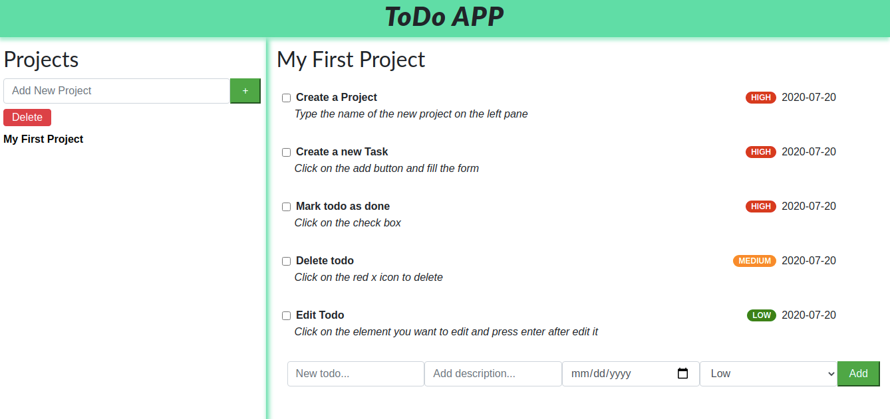

# Javascript ToDo List
  
## About
This project is part of the Microverse Curriculum projects. It is a Javascript web application to practice OOP principles and webpack.
This is a Todo List where you can create a new project and add taks.

### In this project you are able to:

- Introduce a task name
- Introduce a description
- Set a due date
- Set a priority
- Edit a task
- Delete a task
- Delete a Project

## Project specifications
* [The Odin Project: ToDo List](https://www.theodinproject.com/courses/javascript/lessons/todo-list)

## Build with
* JavaScript
* Webpack
* CSS
* LocalStorage
* [Bootstrap](https://getbootstrap.com/)

## Live Version
Check the live version [here](https://rawcdn.githack.com/nriqu322/To-Do-List/c313d2e83afc6100a1d44504276bc45728c038d5/dist/index.html).

## Future Features
* Sign up feature
* Automated email when the due date is close.

## Author

👤 **Luis Saavedra**
- Github: [@nriqu322](https://github.com/nriqu322)
- Twitter: [@nriqu322](https://twitter.com/nriqu322)
- Linkedin: [Luis Saavedra](https://linkedin.com/in/luis-saavedra-sanchez/)

---

## 🤝 Contributing

Contributions, issues and feature requests are welcome!

Feel free to check the [issues page](issues/).

## Show your support

Give a ⭐️ if you like this project!

## Acknowledgments

[Microverse](https://microverse.org)

---

## 📝 License

This project is [MIT](/LICENSE) licensed.

---